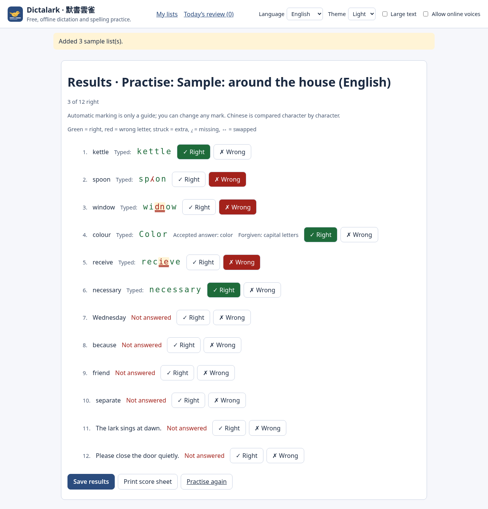

# Dictalark · 默書雲雀

**English** · [繁體中文](#繁體中文)

Dictalark is a free, open-source, offline dictation and spelling practice tool for
families, students, tutors and homework clubs. Type in (or import) your own word
list; the device's voice or **your own recording** reads it aloud in English,
Cantonese or Mandarin; then mark the paper by hand or type the answers and get
fair automatic marking that shows letter by letter what went wrong. Words that
were wrong come back for review on a spaced-repetition schedule.

Everything that weekly-subscription dictation apps usually lock behind a paywall
(teacher mode with repeats and pauses, shuffled order, saved lists, review of
mistakes) is free here, with **no ads, no accounts and no tracking**.

- Your word lists, results and **recordings stay on your device** (IndexedDB in
  your browser). Dictalark makes no network requests after the page loads.
- English and Traditional Chinese (Hong Kong) interface.
- **New in v0.2:** "read as" text per word (fixes characters a device voice reads with
  the wrong sound), full backups that include recordings, start from any item and
  continue after stopping, passage mode (split at punctuation) with your own names for
  punctuation marks, a voices page to try and choose voices, share a list as a link
  (no server), and the browser is asked to keep Dictalark's storage, with a gentle
  backup reminder.
- **New in v0.3:** a QR code for share links (made on the device), and class lists by
  file: teachers send a class pack, pupils open it (later packs update their copies) and
  send back a results file (counts only, never what they typed); teachers open many
  results files for a summary and a CSV. No accounts, no server.
- Licence: [AGPL-3.0-or-later](LICENSE).
- How to use it, including how to add a Cantonese voice to your device:
  [guide](docs/guide.md).



### Use it

- **Online:** <https://kinfxhk.github.io/dictalark/> (after the first visit it also
  works offline; nothing you enter is sent anywhere).
- **Download:** the static site zip on the
  [releases page](https://github.com/Kinfxhk/dictalark/releases) (with a SHA-256
  checksum). Serve the folder from `localhost` or `https`.
- **From source** (Node.js 22 or later):

```sh
npm ci
npm start          # builds, then serves on http://127.0.0.1:4887/
```

- **Container:** `docker build -t dictalark . && docker run --rm -p 127.0.0.1:4887:4887 dictalark`

### Important

- Automatic marking is **only a guide**. For Chinese it compares characters
  exactly and never converts between Traditional and Simplified or merges variant
  characters, so a parent or teacher should check Chinese answers by hand.
- Voices come from your device. If it has no Cantonese voice, record the words
  yourself; the app tells you when a voice is missing.
- Dictalark ships only a few small sample lists written for this project (CC0).
  Please do not publish word lists copied from textbooks or exam papers.
- Dictalark is an independent project and is **not affiliated** with, endorsed by
  or sponsored by any other dictation or spelling product or company.
- Name check: no identical mark was found in the USPTO or WIPO databases; the Hong
  Kong Intellectual Property Department search could not be checked (未能核實). See
  [docs/NAME-CHECK.md](docs/NAME-CHECK.md).

## Commitments

Dictalark will **never** have:

- **ads**;
- **tracking or analytics** of any kind, not even "anonymous";
- **paid unlocking**, subscriptions, daily limits or accounts.

Every feature stays free for everyone. The code stays open source under
AGPL-3.0-or-later, so nobody can turn it into a closed paid service without
sharing their changes. Donations are optional and change nothing in the app.

## Contributing

Contributions are welcome under the rules in [CONTRIBUTING.md](CONTRIBUTING.md):
clean-room work only (no code, text, word lists or screenshots from other apps,
textbooks or exam papers), fair-marking changes need golden, property and
mutation tests, and commits are signed off (DCO). Everyone taking part follows
the [Code of Conduct](CODE_OF_CONDUCT.md).

**How it is made:** Dictalark is written with AI coding agents working under the
maintainer's direction. That is why the project leans so hard on machine
checking: an independent checker must accept every marking diff, and golden,
property, oracle and mutation tests, a licence allowlist, a hygiene check and a
secret scan run on every change, on Linux and Windows. Contributors may use AI
tools too, under the
[AI-assisted development policy](CONTRIBUTING.md#ai-assisted-development).

Source code: <https://github.com/Kinfxhk/dictalark>

If Dictalark helps your family, you can support it at
[Buy Me a Coffee](https://buymeacoffee.com/kinfxhk).

---

## 繁體中文

默書雲雀（Dictalark）是免費、開源、可離線使用的默書及串字練習工具，適合家長、學生、
補習老師及功課輔導班。輸入（或匯入）你自己的詞表，由裝置語音或**你自己的錄音**以英文、
粵語或普通話讀出；之後可以在紙上默寫再逐項批改，或者直接打字，由程式公平地自動批改，
並逐個字母顯示錯在哪裏。錯了的詞語會按間隔重複安排再溫。

一般默書訂閱 app 要付費才有的功能（老師模式重複讀及停頓、調亂詞序、儲存詞表、錯字
重溫），在這裏全部免費，而且**沒有廣告、無需帳戶、沒有追蹤**。

- 詞表、成績及**錄音只存於你的裝置**（瀏覽器的 IndexedDB）。網頁載入後不會再發出
  任何網絡請求。
- 提供英文及繁體中文（香港）介面。
- **v0.2 新功能：**每個詞語可設「讀出文字」（解決裝置語音讀錯多音字）、備份包括錄音、可以由任何一項開始，
  停止後可以繼續、段落模式（按標點分句）及自訂標點讀法、語音試聽頁、以連結分享詞表（不經伺服器），
  並會要求瀏覽器保留資料，加上溫和的備份提示。
- **v0.3 新功能：**分享連結附 QR 碼（在裝置上產生）；用檔案派發詞表：老師儲存詞表包，學生開啟（之後再派會更新），
  再交回成績檔（只有數目，永不包括輸入內容）；老師一次開啟多個成績檔，即有摘要及 CSV。無需帳戶，亦無伺服器。
- 授權：[AGPL-3.0-or-later](LICENSE)。
- 使用方法（包括如何為裝置加入粵語語音）：[使用指南](docs/guide.zh-Hant.md)。

### 使用方法

- **網上版：**<https://kinfxhk.github.io/dictalark/>（首次開啟後可離線使用；輸入的內容不會傳送到任何地方）。
- **下載：**[發佈頁](https://github.com/Kinfxhk/dictalark/releases)提供靜態網站 zip 及 SHA-256 校驗碼，
  請以 `localhost` 或 `https` 開啟。
- **從原始碼執行**（Node.js 22 或以上）：`npm ci`，然後 `npm start`，開啟 http://127.0.0.1:4887/ 。

### 重要事項

- 自動批改**只供參考**。中文會逐字比對，不會做繁簡轉換，亦不會合併異體字，所以中文
  默書請家長或老師人手核對。
- 讀音來自你的裝置。如果裝置沒有粵語語音，可以自己錄音；程式會提示哪種語音缺少。
- 默書雲雀只附帶少量為本項目自寫的示範詞表（CC0）。請不要公開分享從課本或試卷抄錄的詞表。
- 默書雲雀是獨立項目，與任何其他默書或串字產品或公司**並無關連**，亦未獲其認可或贊助。
- 名稱查核：USPTO 及 WIPO 資料庫未見相同商標；香港知識產權署的檢索未能核實。詳見
  [docs/NAME-CHECK.md](docs/NAME-CHECK.md)。

### 承諾

默書雲雀**永遠不會有廣告**，亦不會加入：

- 任何形式的**追蹤或分析工具**（即使聲稱「匿名」也不會）；
- **付費解鎖**、訂閱、每日次數限制或帳戶。

所有功能永遠免費。程式碼以 AGPL-3.0-or-later 開源，任何人都不能把它改成封閉的收費服務
而不公開修改。捐款純屬自願，不會改變程式任何功能。

### 開發方式及參與

歡迎按 [CONTRIBUTING.md](CONTRIBUTING.md) 的規則參與：只接受 clean-room 原創內容（不可
抄錄其他 app、課本或試卷的程式碼、文字、詞表或截圖），批改規則的改動須附黃金、性質及
變異測試，commit 須簽署（DCO）。所有參與者須遵守[行為守則](CODE_OF_CONDUCT.md)。

**開發方式：**默書雲雀由 AI 編程助手在維護者指示下編寫，所以本項目非常依賴機器檢查：
每個批改差異都要經獨立檢查器驗證，每次改動都會在 Linux 及 Windows 上執行黃金、性質、
oracle 及變異測試、授權白名單、衞生檢查及秘密掃描。貢獻者亦可使用 AI 工具，但須遵守
[AI 協助開發政策](CONTRIBUTING.md#ai-assisted-development)。

原始碼：<https://github.com/Kinfxhk/dictalark>

如果默書雲雀對你的家庭有幫助，歡迎到 [Buy Me a Coffee](https://buymeacoffee.com/kinfxhk) 支持。
